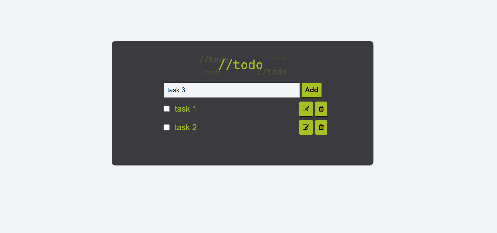

# SBA316: To-Do List Web Application

This is a project for the Per Scholas skill-based assessment: the Document Object Model.

## Features

1. **Add Task:** Users can add a new task by entering the task description in the input field and clicking the "Add" button. The "Add" button has a hover effect.
2. **Validation:** If the input field is empty and the user clicks the "Add" button, the application will show an alert to prompt the user to enter a task description. (`window.alert()`)
3. **Checkbox and Strikethrough:** By clicking the checkbox and adding a strikethrough style to the task, users can mark a task done.
4. **Edit Task:** Users can edit a task by clicking the edit button (pencil icon). After clicking the edit button, a text input field and an update button will appear, After modifying the task description, users can click the update button to save the update.
5. **Delete Task:** Users can delete a task by clicking the delete button (trashcan icon).

## Usage

Clone or download the project to your local machine, and open the `index.html` file in a web browser.

## Code Structure

Event listeners are set up for the following functions:
(1) add task; (2) checkbox and strikethrough; (3) delete button; (4) edit button.

## Preview

